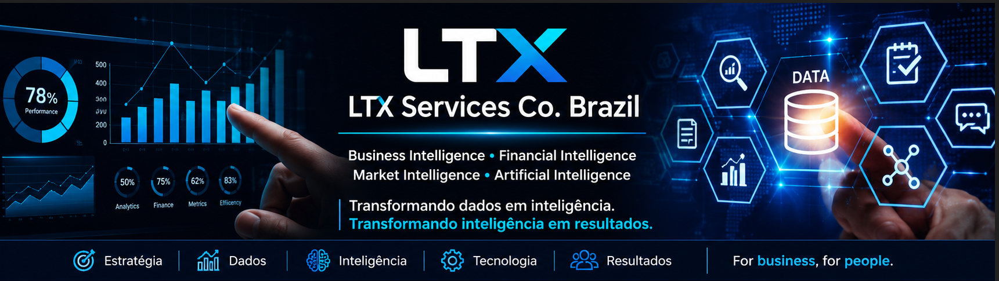

  

# LTX Services Co. Brazil

## Business Intelligence • Financial Intelligence • Market Intelligence • Artificial Intelligence

> **Transformando dados em inteligência. Transformando inteligência em resultados.**

---

# Sobre a LTX Services Co. Brazil

A **LTX Services Co. Brazil** é uma empresa especializada em Inteligência Empresarial, Consultoria Financeira, Inteligência de Mercado, Business Intelligence, Engenharia de Dados e Inteligência Artificial aplicada aos negócios.

Nossa atuação integra estratégia, gestão, finanças, tecnologia e ciência de dados para apoiar organizações no desenvolvimento de modelos de gestão mais eficientes, sustentáveis e orientados por evidências.

A atuação da empresa é fundamentada na experiência profissional acumulada por seus fundadores e especialistas ao longo de mais de quinze anos em organizações industriais e de serviços, permitindo o desenvolvimento de soluções alinhadas aos desafios contemporâneos da gestão empresarial.

Nosso propósito é transformar informações em conhecimento estratégico, apoiando organizações na melhoria da performance, na otimização de processos e na tomada de decisões de alto impacto.

---

# Quem Somos

A LTX Services Co. Brazil nasceu com o propósito de integrar gestão empresarial, inteligência analítica e tecnologia em um modelo de consultoria voltado à geração de valor para organizações de diferentes segmentos.

Acreditamos que decisões estratégicas dependem da combinação entre conhecimento técnico, dados confiáveis, processos estruturados e visão de longo prazo.

Nossa atuação busca conectar pessoas, processos e tecnologia para desenvolver soluções que fortaleçam a competitividade, promovam inovação e ampliem a capacidade analítica das organizações.

---

# Missão

Transformar dados em inteligência aplicada, permitindo que organizações tomem decisões estratégicas fundamentadas, ampliem sua eficiência operacional e promovam resultados sustentáveis por meio da integração entre gestão, tecnologia e inovação.

---

# Visão

Ser reconhecida como referência em Inteligência Empresarial, contribuindo para a evolução da gestão corporativa por meio da integração entre conhecimento, tecnologia, ciência de dados e Inteligência Artificial.

---

# Valores

- Ética e Integridade
- Excelência Técnica
- Transparência
- Responsabilidade
- Compromisso com Resultados
- Desenvolvimento Contínuo
- Inovação
- Aprendizado Permanente
- Orientação por Dados
- Respeito às Pessoas e às Organizações

---

# Nossa Experiência

Nossa atuação é sustentada pela experiência profissional desenvolvida em empresas industriais e de serviços, abrangendo diferentes segmentos econômicos.

Entre eles:

- Indústria de Alimentos e Bebidas
- Metalurgia e Transformação Industrial
- Educação
- Varejo
- Distribuição
- Logística
- Prestação de Serviços
- Operações Industriais
- Transformação Digital

Essa diversidade proporciona uma visão abrangente dos desafios relacionados à gestão financeira, controladoria, planejamento estratégico, inteligência de mercado, análise de dados e transformação organizacional.

---

# Áreas de Atuação

## Inteligência Empresarial

Estruturação de modelos analíticos para apoio à tomada de decisão, integração de indicadores corporativos e desenvolvimento de ambientes orientados por dados.

---

## Consultoria Financeira

Planejamento financeiro, modelagem financeira, orçamento empresarial, fluxo de caixa, análises econômico-financeiras, investimentos, estrutura de capital e apoio à gestão executiva.

---

## Controladoria

Gestão de custos, indicadores de desempenho, FP&A, orçamento empresarial, governança corporativa e modelos de controle gerencial.

---

## Inteligência de Mercado

Estudos setoriais, inteligência competitiva, avaliação de oportunidades, análise de mercado e suporte ao posicionamento estratégico.

---

## Business Intelligence

Desenvolvimento de dashboards executivos, indicadores-chave de desempenho (KPIs), integração de dados e monitoramento da performance organizacional.

---

## Engenharia de Dados

Arquitetura de dados, integração entre sistemas, processos ETL, modelagem de dados e preparação de ambientes analíticos.

---

## Inteligência Artificial

Desenvolvimento de soluções baseadas em Inteligência Artificial, agentes inteligentes, automação de processos, processamento de linguagem natural e apoio à tomada de decisão.

---

## Transformação Digital

Modernização de processos organizacionais por meio da integração entre tecnologia, automação, dados e inovação.

---

# Metodologia

Nossa metodologia está estruturada em cinco etapas:

### 1. Diagnóstico Estratégico

Compreensão do contexto organizacional, identificação de oportunidades e definição dos objetivos do projeto.

### 2. Estruturação das Informações

Organização, integração e preparação das bases de dados necessárias às análises.

### 3. Inteligência Analítica

Transformação de dados em conhecimento estratégico por meio de métodos quantitativos, financeiros e analíticos.

### 4. Implementação

Desenvolvimento das soluções, integração aos processos organizacionais e acompanhamento da implantação.

### 5. Evolução Contínua

Monitoramento de indicadores, melhoria contínua e aperfeiçoamento permanente das soluções implementadas.

---

# Diferenciais

- Mais de quinze anos de experiência profissional em organizações industriais e de serviços.
- Integração entre gestão empresarial, finanças, tecnologia e Inteligência Artificial.
- Atuação orientada por dados, indicadores e evidências.
- Desenvolvimento de soluções personalizadas.
- Visão integrada dos processos financeiros, operacionais e estratégicos.
- Compromisso com resultados sustentáveis.
- Foco na geração contínua de valor para clientes e parceiros.

---

# Pesquisa, Desenvolvimento e Inovação

A LTX Services Co. Brazil mantém iniciativas contínuas de pesquisa e desenvolvimento voltadas à evolução da gestão empresarial e à aplicação de tecnologias emergentes.

As principais linhas de pesquisa incluem:

- Inteligência Artificial aplicada aos negócios
- Business Intelligence
- Inteligência Financeira
- Inteligência de Mercado
- Engenharia de Dados
- Ciência de Dados
- Analytics Avançado
- Modelagem Financeira
- Automação de Processos
- Agentes Inteligentes
- Sistemas de Apoio à Decisão
- Governança da Informação
- Transformação Digital

---

# Áreas de Conhecimento

- Business Intelligence
- Financial Intelligence
- Market Intelligence
- Financial Consulting
- Corporate Finance
- FP&A
- Controllership
- Business Analytics
- Data Analytics
- Data Engineering
- Data Science
- Artificial Intelligence
- Machine Learning
- Predictive Analytics
- Strategic Planning
- Cost Management
- Digital Transformation
- Process Automation
- Corporate Performance
- Executive Dashboards

---

# Compromisso

Acreditamos que tecnologia somente gera valor quando aplicada à solução de desafios reais das organizações.

Nosso compromisso consiste em transformar dados em conhecimento, conhecimento em inteligência e inteligência em decisões capazes de fortalecer a competitividade, a sustentabilidade e o crescimento das empresas.

---

# Contato

**LTX Services Co. Brazil**

📧 ltxservices.co@gmail.com

---

> **Transformando dados em inteligência. Transformando inteligência em resultados.**
